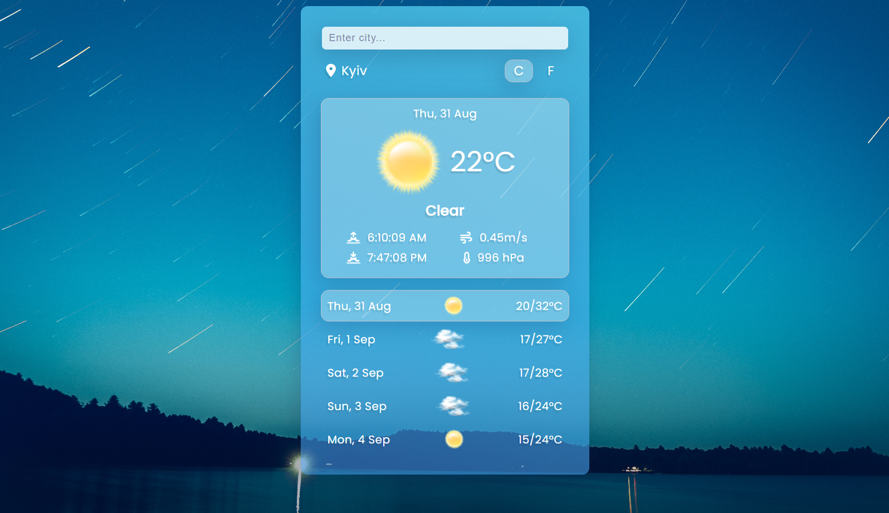

# Weather Forecast App

The Weather Forecast App utilizes the [OpenWeatherMap API](https://api.openweathermap.org) to provide real-time weather data for various locations. It's built with JavaScript, follows an object-oriented approach, and includes the following features:

- Real-time weather data
- 6-day forecast
- Celsius/Fahrenheit conversion
- Dynamic background based on time of day
- Geolocation for current weather or fallback to Kyiv
- Search history stored in Local Storage

## Tech Stack

- JavaScript
- OpenWeatherMap API
- HTML/CSS
- Local Storage
- [Font Awesome](https://fontawesome.com/)

## Usage

1. Grant geolocation access for weather based on your location or view weather for Kyiv if denied.
2. Search for a city to see its weather forecast.
3. Toggle between Celsius and Fahrenheit.
4. Enjoy dynamic backgrounds that change with the time of day.

## Screenshots

_Morning Background_

_Daytime Background_

_Night Background_
